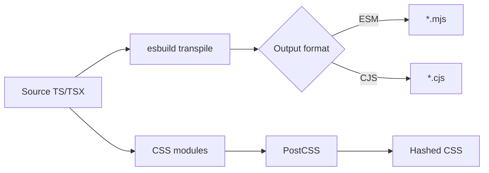

# Architecture Overview

Understanding the workspace structure, build pipeline, and module system for React + TypeScript library projects.

## Table of Contents

- [Workspace Structure](#workspace-structure)
- [Build Pipeline](#build-pipeline)
- [Module System](#module-system)
- [Type Generation](#type-generation)
- [Documentation Architecture](#documentation-architecture)
- [Development Workflow](#development-workflow)

---

## Workspace Structure

### Yarn Workspaces

The project uses **Yarn workspaces** to manage a monorepo with multiple packages:

```
root/
├── package.json          # Workspace root
├── package/              # Library package (published to npm)
│   ├── package.json
│   ├── src/
│   └── dist/             # Build output (generated)
└── docs/                 # Documentation site (not published)
    ├── package.json
    ├── pages/
    └── demos/
```

**Key concepts:**

- **Root workspace:** Orchestrates scripts and shared dependencies
- **Library workspace (`package/`):** Contains the actual library code
- **Docs workspace (`docs/`):** Next.js site for documentation and demos

**Benefits:**

- Shared dependency resolution
- Cross-workspace imports without publishing
- Unified script execution
- Consistent versioning with `syncpack`

---

### Package Workspace

The library package structure:

```
package/
├── package.json          # npm package metadata
├── src/
│   ├── index.ts          # Main entry point
│   ├── Component.tsx     # React component
│   ├── Component.module.css
│   ├── Component.test.tsx
│   └── Component.story.tsx
└── dist/                 # Build output
    ├── esm/              # ES modules (.mjs)
    ├── cjs/              # CommonJS (.cjs)
    └── types/            # TypeScript declarations (.d.ts)
```

**Important files:**

- **`index.ts`:** Defines public API (exports)
- **`package.json`:** Specifies entry points (`main`, `module`, `types`, `exports`)
- **`dist/`:** Generated during build, not committed to git

---

### Documentation Workspace

Next.js documentation site structure:

```
docs/
├── package.json
├── pages/
│   ├── _app.tsx          # App wrapper
│   └── index.tsx         # Landing page
├── demos/                # Component demos
│   ├── data.ts           # Mock data
│   └── Component.demo.tsx
├── components/           # Doc site components
├── public/               # Static assets
└── out/                  # Build output (static export)
```

**Key features:**

- **MDX support:** Write docs in Markdown with embedded React
- **Static export:** Generates static HTML for deployment
- **Component demos:** Interactive examples in sandbox
- **Props documentation:** Auto-generated from TypeScript types

---

## Build Pipeline

### Overview

The build process transforms TypeScript source into distributable formats:

```
src/Component.tsx
    ↓
[Rollup + esbuild]
    ↓
dist/
├── esm/Component.mjs     (ES modules for modern bundlers)
├── cjs/Component.cjs     (CommonJS for Node.js)
└── types/Component.d.ts  (TypeScript declarations)
```

---

### Rollup Configuration

**Purpose:** Bundle library code for distribution

**Key plugins:**

1. **`rollup-plugin-node-externals`:** Excludes dependencies from bundle
2. **`@rollup/plugin-node-resolve`:** Resolves imports
3. **`rollup-plugin-esbuild`:** Transpiles TypeScript to JavaScript
4. **`rollup-plugin-postcss`:** Processes CSS modules
5. **`@rollup/plugin-replace`:** Environment variable substitution

**Build process:**



**Configuration highlights:**

```javascript
// rollup.config.mjs
export default {
  input: 'package/src/index.ts',
  output: [
    { format: 'es', dir: 'package/dist/esm' },
    { format: 'cjs', dir: 'package/dist/cjs' },
  ],
  plugins: [
    nodeExternals(),
    nodeResolve(),
    esbuild({ tsconfig: 'tsconfig.build.json' }),
    postcss({ extract: true, modules: true }),
  ],
};
```

---

### Type Generation

**Process:**

1. TypeScript compiler (`tsc`) generates `.d.ts` files
2. Separate script bundles types into single entry point
3. Dual declarations for ESM (`.d.mts`) and CJS (`.d.ts`)

**Scripts:**

```bash
# Generate declarations
tsc --emitDeclarationOnly --declarationDir package/dist/types

# Bundle types (custom script)
tsx scripts/generate-dts.ts
```

**Result:**

```
dist/types/
├── index.d.ts       # CommonJS types
├── index.d.mts      # ESM types
└── Component.d.ts   # Individual component types
```

---

### CSS Processing

**CSS Modules workflow:**

1. Source: `Component.module.css`
2. PostCSS transforms (autoprefixer, nesting, variables)
3. Hash class names for scoping
4. Extract to separate CSS file

**Configuration:**

```javascript
// postcss.config.js
module.exports = {
  plugins: [
    require('postcss-preset-mantine')(),
    // Includes: autoprefixer, nesting, custom properties
  ],
};
```

**Output:**

```
dist/esm/Component.css
  .Component-root-a1b2c3 { ... }
```

**Usage in consuming apps:**

```typescript
import 'library/dist/esm/Component.css'; // Import styles
import { Component } from 'library'; // Import component
```

---

## Module System

### Dual Package Structure

**Why dual packages?**

- **ESM:** Modern bundlers (Webpack, Vite, Rollup) tree-shake unused code
- **CJS:** Node.js and older tools require CommonJS
- **Best of both:** Package works everywhere

**`package.json` exports field:**

```json
{
  "main": "./dist/cjs/index.cjs",
  "module": "./dist/esm/index.mjs",
  "types": "./dist/types/index.d.ts",
  "exports": {
    ".": {
      "import": {
        "types": "./dist/types/index.d.mts",
        "default": "./dist/esm/index.mjs"
      },
      "require": {
        "types": "./dist/types/index.d.ts",
        "default": "./dist/cjs/index.cjs"
      }
    },
    "./styles.css": "./dist/esm/index.css"
  }
}
```

**Import resolution:**

- Modern bundlers: Use `exports` → `import` → `index.mjs`
- Node.js: Use `exports` → `require` → `index.cjs`
- TypeScript: Use `types` field for declarations

---

### Tree Shaking

**Preserving tree shaking:**

- Use **`preserveModules: true`** in Rollup config
- Avoid default exports (harder to tree-shake)
- Use named exports for all public APIs

**Example:**

```typescript
// ✅ Good: Named exports
export { Button } from './Button';
export { Input } from './Input';

// Consumer can tree-shake unused components
import { Button } from 'library'; // Only Button is bundled
```

---

## Type Generation

### Declaration Files

**TypeScript generates:**

- `.d.ts` files for each source file
- Type-only exports for interfaces/types
- Preserves JSDoc comments

**Custom type bundling script:**

Located in `scripts/generate-dts.ts`:

1. Collects all `.d.ts` files from build
2. Resolves internal imports
3. Creates unified type bundle
4. Generates both `.d.ts` and `.d.mts` variants

**Ensures:**

- Consumers get accurate type information
- IntelliSense works in IDEs
- Type-checking works for library users

---

## Documentation Architecture

### Component Documentation

**Auto-generated props tables:**

The `docgen` script uses `mantine-docgen-script` to:

1. Parse TypeScript component props
2. Extract JSDoc comments
3. Generate JSON metadata
4. Inject into MDX documentation

**Flow:**

```
Component.tsx (with JSDoc)
    ↓
[docgen script]
    ↓
docgen.json (props metadata)
    ↓
docs/docs.mdx (MDX page)
    ↓
<PropsTable /> component
```

**Example JSDoc:**

```typescript
export interface ButtonProps {
  /** Button variant style */
  variant?: 'primary' | 'secondary';

  /** Size of the button */
  size?: 'sm' | 'md' | 'lg';
}
```

Generates props table in documentation automatically.

---

### Demo System

**Demo structure:**

```
docs/demos/
├── data.ts                    # Mock data
├── columns.tsx                # Reusable definitions
└── Component.demo.tsx         # Individual demos
```

**Demo file format:**

```typescript
// Component.demo.configurator.tsx
import { Component } from '@workspace/package';
import type { DemoProps } from '@mantinex/demo';

export const configurator: DemoProps = {
  type: 'configurator',
  component: Component,
  code: `<Component variant="primary" />`,
  controls: [
    { prop: 'variant', type: 'segmented', data: ['primary', 'secondary'] },
  ],
};
```

**Demo types:**

- **Configurator:** Interactive props playground
- **Code:** Static code example
- **Demo:** Free-form interactive example

---

## Development Workflow

### Local Development Loop

1. **Make changes** to `package/src/Component.tsx`
2. **Rebuild library:** `yarn build`
3. **Start docs:** `yarn dev`
4. **View changes** at `http://localhost:9xxx`

**Hot reload:**

- Docs code: Hot reloads automatically
- Library code: Requires rebuild (step 2)

---

### Watch Mode (Future Enhancement)

Consider adding watch mode for faster iteration:

```bash
# Watch library and rebuild on changes
rollup -c -w &

# Start docs dev server
yarn dev
```

---

### Production Build

**Full production workflow:**

```bash
# 1. Clean previous builds
yarn clean

# 2. Build library
yarn build

# 3. Generate documentation
yarn docgen

# 4. Build docs site
cd docs && yarn build

# 5. Deploy
yarn docs:deploy
```

**Outputs:**

- `package/dist/` - Publishable library
- `docs/out/` - Static documentation site

---

## Dependency Management

### Shared Dependencies

**Root `package.json` (devDependencies):**

- Build tools (Rollup, esbuild, TypeScript)
- Testing (Jest, Testing Library)
- Linting (ESLint, Prettier, Stylelint)
- Scripts (tsx, fs-extra, etc.)

**Package `package.json` (peerDependencies):**

- React, React DOM (let consumer provide version)
- Mantine (if using Mantine components)

**Docs `package.json` (dependencies):**

- Next.js framework
- Workspace library (`workspace:*`)
- MDX tooling
- Demo components

---

### Version Consistency

**`syncpack` enforces:**

- Same version of React across workspaces
- Consistent dependency versions
- Prevents version drift

**Commands:**

```bash
# Check for mismatches
yarn syncpack list-mismatches

# Auto-fix versions
yarn syncpack format
```

---

## Summary

**Key architectural principles:**

1. **Separation of concerns:** Library vs. documentation
2. **Dual module support:** ESM + CJS for compatibility
3. **Type safety:** Complete TypeScript declarations
4. **Automated documentation:** Props extracted from source
5. **Monorepo benefits:** Shared tooling, consistent workflows
6. **Production-ready:** Optimized bundles, tree-shakeable exports

This architecture supports:
- ✅ Modern bundler optimization
- ✅ Node.js compatibility
- ✅ TypeScript IntelliSense
- ✅ Rapid development iteration
- ✅ Static documentation hosting
